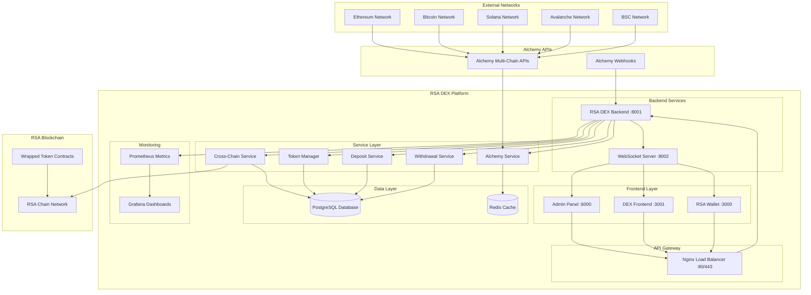
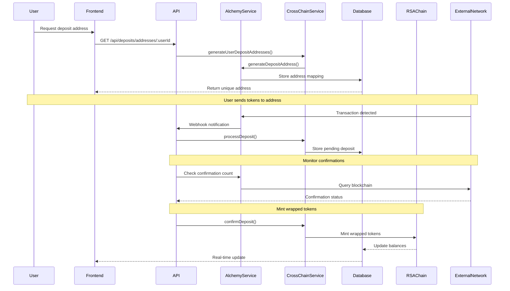
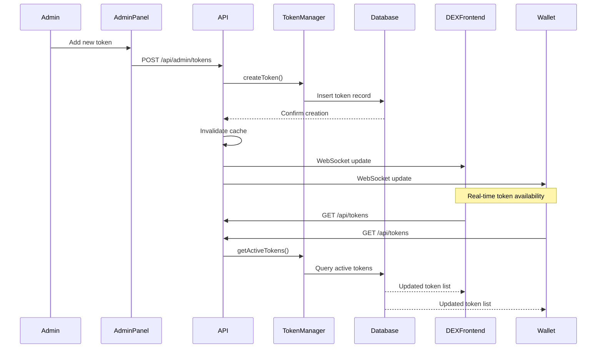
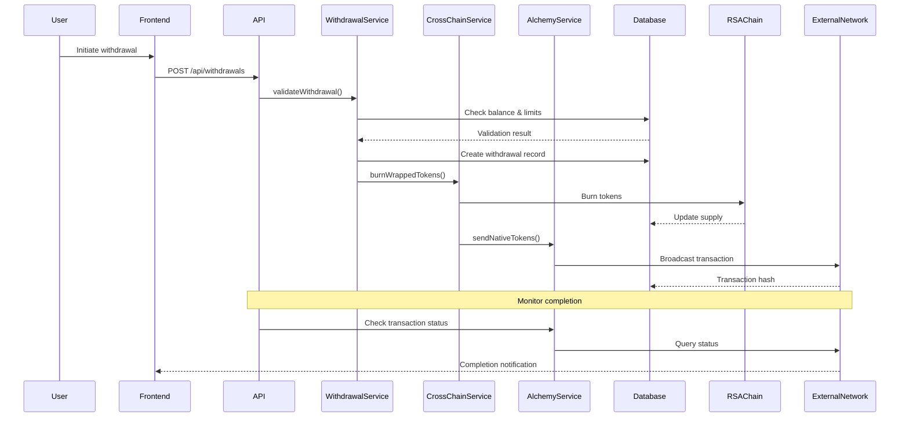
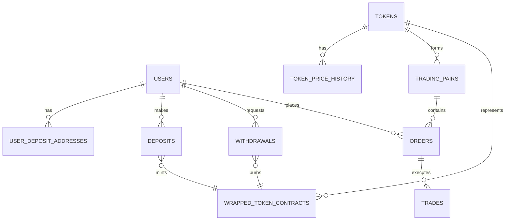
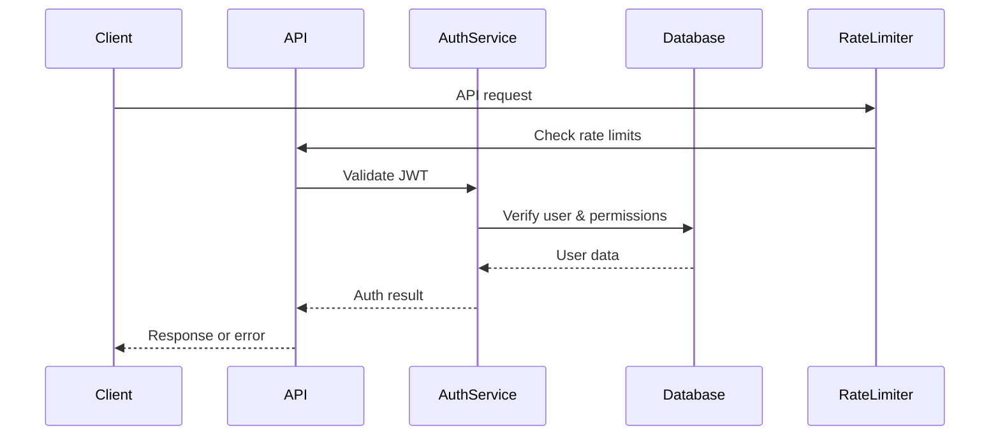
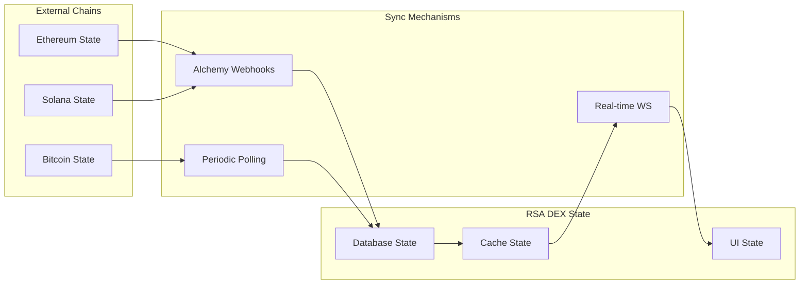

# 🏗️ RSA DEX Cross-Chain System Architecture Map

## 🎯 **System Overview**

The RSA DEX Cross-Chain Integration platform is designed as a scalable, enterprise-grade multi-chain DEX with dynamic token management capabilities. This document provides a comprehensive view of the system architecture, data flow, and integration patterns.

## 📊 **High-Level Architecture Diagram**



## 🔄 **Data Flow Architecture**

### **1. Cross-Chain Deposit Flow**



### **2. Dynamic Token Management Flow**



### **3. Withdrawal Processing Flow**



## 🏛️ **Component Architecture**

### **Frontend Layer**

```
┌─────────────────────────────────────────────────────────────┐
│                    Frontend Applications                    │
├─────────────────┬─────────────────┬─────────────────────────┤
│   Admin Panel   │   DEX Frontend  │      RSA Wallet         │
│   (Next.js)     │   (React)       │      (React)            │
│   Port: 6000    │   Port: 3001    │      Port: 3000         │
│                 │                 │                         │
│ • Token Mgmt    │ • Trading UI    │ • Multi-chain View     │
│ • User Mgmt     │ • Order Book    │ • Send/Receive         │
│ • Analytics     │ • Portfolio     │ • Address Book         │
│ • Settings      │ • Bridge UI     │ • Security             │
└─────────────────┴─────────────────┴─────────────────────────┘
```

### **API Gateway Layer**

```
┌─────────────────────────────────────────────────────────────┐
│                    Nginx Load Balancer                     │
├─────────────────────────────────────────────────────────────┤
│ • SSL Termination                                           │
│ • Request Routing                                           │
│ • Rate Limiting                                             │
│ • Static Asset Serving                                      │
│ • Health Checks                                             │
└─────────────────────────────────────────────────────────────┘
```

### **Backend Services Layer**

```
┌─────────────────────────────────────────────────────────────┐
│                  RSA DEX Backend API                       │
├─────────────────────────────────────────────────────────────┤
│ Express.js Server (Port: 8001) + WebSocket (Port: 8002)    │
├─────────────────┬─────────────────┬─────────────────────────┤
│  Alchemy Service│ Cross-Chain Svc │    Token Manager        │
│                 │                 │                         │
│ • Multi-chain   │ • Deposit Mgmt  │ • Dynamic Config        │
│ • Address Gen   │ • Withdrawal    │ • Price Feeds           │
│ • Monitoring    │ • Minting/Burn  │ • Validation            │
│ • Webhooks      │ • Confirmations │ • Trading Pairs         │
├─────────────────┼─────────────────┼─────────────────────────┤
│ Deposit Service │Withdrawal Svc   │    Auth & Security      │
│                 │                 │                         │
│ • Balance Track │ • Validation    │ • JWT Tokens            │
│ • Confirmation  │ • Processing    │ • Rate Limiting         │
│ • Notifications │ • Fee Calc      │ • Input Validation      │
│ • Statistics    │ • Audit Trail   │ • RBAC                  │
└─────────────────┴─────────────────┴─────────────────────────┘
```

### **Data Layer**

```
┌─────────────────────────────────────────────────────────────┐
│                     Data Storage                            │
├─────────────────────────┬───────────────────────────────────┤
│    PostgreSQL DB        │        Redis Cache               │
│                         │                                   │
│ • User accounts         │ • Session storage                 │
│ • Token configs         │ • Rate limit counters             │
│ • Transactions          │ • Real-time data                  │
│ • Audit logs            │ • API response cache              │
│ • Network status        │ • WebSocket sessions              │
│ • Analytics data        │ • Temporary data                  │
└─────────────────────────┴───────────────────────────────────┘
```

## 🗃️ **Database Schema Design**

### **Core Tables Structure**

```sql
-- User Management
users (id, email, username, password_hash, role, created_at)
user_deposit_addresses (user_id, network, address, private_key)

-- Token Management
tokens (id, symbol, name, network, decimals, config...)
token_price_history (token_id, price, source, timestamp)
wrapped_token_contracts (symbol, network, contract_address, supply)

-- Cross-Chain Operations
deposits (id, user_id, network, tx_hash, amount, status, confirmations)
withdrawals (id, user_id, network, tx_hash, amount, status)

-- Trading & DEX
trading_pairs (base_token_id, quote_token_id, is_active)
orders (id, user_id, pair_id, type, price, amount, status)
trades (id, pair_id, buy_order_id, sell_order_id, price, amount)

-- System Monitoring
network_status (network, is_online, block_height, last_checked)
audit_logs (table_name, operation, user_id, changes, timestamp)
```

### **Data Relationships**



## 🔗 **External Integrations**

### **Alchemy API Integration**

```
┌─────────────────────────────────────────────────────────────┐
│                    Alchemy Integration                     │
├─────────────────────────────────────────────────────────────┤
│ API Key: VSDZI0dFEh6shTS4qYsKd                              │
├─────────────────┬─────────────────┬─────────────────────────┤
│   Ethereum      │    Bitcoin      │       Solana            │
│   Avalanche     │      BSC        │                         │
├─────────────────┼─────────────────┼─────────────────────────┤
│ • Get balance   │ • Monitor addr  │ • Real-time webhooks    │
│ • Send TX       │ • TX details    │ • Block confirmations   │
│ • Address gen   │ • Network stats │ • Error handling        │
│ • Event logs    │ • Gas estimates │ • Rate management       │
└─────────────────┴─────────────────┴─────────────────────────┘
```

### **Blockchain Network Specifications**

| Network | Confirmations | Block Time | API Endpoint |
|---------|---------------|------------|--------------|
| Ethereum | 12 blocks | ~12 seconds | eth-mainnet.g.alchemy.com |
| Bitcoin | 3 blocks | ~10 minutes | bitcoin-mainnet.g.alchemy.com |
| Solana | 32 slots | ~0.4 seconds | solana-mainnet.g.alchemy.com |
| Avalanche | 12 blocks | ~2 seconds | avax-mainnet.g.alchemy.com |
| BSC | 12 blocks | ~3 seconds | bnb-mainnet.g.alchemy.com |

## 🚀 **Deployment Architecture**

### **Development Environment**

```
┌─────────────────────────────────────────────────────────────┐
│                Development Environment                      │
├─────────────────────────────────────────────────────────────┤
│ Host: localhost                                             │
├─────────────────┬─────────────────┬─────────────────────────┤
│ Backend :8001   │ Admin :6000     │ DEX :3001               │
│ WebSocket :8002 │ Wallet :3000    │ PostgreSQL :5432        │
├─────────────────┼─────────────────┼─────────────────────────┤
│ • Hot reload    │ • Live updates  │ • Development DB        │
│ • Debug logs    │ • Mock data     │ • Test networks         │
│ • API testing   │ • Fast builds   │ • Local storage         │
└─────────────────┴─────────────────┴─────────────────────────┘
```

### **Production Environment**

```
┌─────────────────────────────────────────────────────────────┐
│                Production Environment                       │
├─────────────────────────────────────────────────────────────┤
│ Load Balancer (Nginx) → SSL Termination                    │
├─────────────────┬─────────────────┬─────────────────────────┤
│ App Servers     │ Database Cluster│ Monitoring Stack        │
│                 │                 │                         │
│ • Multiple pods │ • Primary/Read  │ • Prometheus metrics    │
│ • Auto-scaling  │ • Automated     │ • Grafana dashboards    │
│ • Health checks │   backups       │ • Alert management      │
│ • Log shipping  │ • Connection    │ • Log aggregation       │
│                 │   pooling       │                         │
├─────────────────┼─────────────────┼─────────────────────────┤
│ Cache Layer     │ Message Queue   │ Security Layer          │
│                 │                 │                         │
│ • Redis cluster │ • Event proc    │ • WAF protection        │
│ • Session store │ • Async jobs    │ • DDoS mitigation       │
│ • Rate limiting │ • Notifications │ • SSL certificates      │
└─────────────────┴─────────────────┴─────────────────────────┘
```

## 🔐 **Security Architecture**

### **Authentication & Authorization Flow**



### **Security Layers**

```
┌─────────────────────────────────────────────────────────────┐
│                    Security Layers                         │
├─────────────────────────────────────────────────────────────┤
│ 1. Network Security                                         │
│    • Firewall rules                                         │
│    • DDoS protection                                        │
│    • SSL/TLS encryption                                     │
├─────────────────────────────────────────────────────────────┤
│ 2. Application Security                                     │
│    • JWT authentication                                     │
│    • Rate limiting                                          │
│    • Input validation                                       │
│    • SQL injection prevention                               │
├─────────────────────────────────────────────────────────────┤
│ 3. Data Security                                            │
│    • Encrypted private keys                                 │
│    • Secure password hashing                                │
│    • Database encryption                                    │
│    • Backup encryption                                      │
├─────────────────────────────────────────────────────────────┤
│ 4. Operational Security                                     │
│    • Audit logging                                          │
│    • Access monitoring                                      │
│    • Incident response                                      │
│    • Key rotation                                           │
└─────────────────────────────────────────────────────────────┘
```

## 📊 **Monitoring & Observability**

### **Metrics Collection**

```
┌─────────────────────────────────────────────────────────────┐
│                  Monitoring Stack                          │
├─────────────────┬─────────────────┬─────────────────────────┤
│  Application    │   Infrastructure │    Business Metrics    │
│   Metrics       │     Metrics      │                         │
├─────────────────┼─────────────────┼─────────────────────────┤
│ • API latency   │ • CPU usage     │ • Trading volume        │
│ • Request rate  │ • Memory usage  │ • User registrations    │
│ • Error rate    │ • Disk I/O      │ • Cross-chain deposits  │
│ • Queue depth   │ • Network I/O   │ • Token additions       │
├─────────────────┼─────────────────┼─────────────────────────┤
│ Collection: Prometheus → Storage: TSDB → Visualization: Grafana │
└─────────────────────────────────────────────────────────────┘
```

### **Alert Management**

```
Critical Alerts    → PagerDuty/SMS → 24/7 Response
Warning Alerts     → Slack/Email  → Business Hours
Info Alerts        → Dashboard    → Monitoring Team
```

## 🔄 **Data Synchronization**

### **Cross-Chain State Synchronization**



## 🔧 **Configuration Management**

### **Environment Configuration**

```
┌─────────────────────────────────────────────────────────────┐
│                Environment Variables                        │
├─────────────────┬─────────────────┬─────────────────────────┤
│  Development    │   Staging       │     Production          │
├─────────────────┼─────────────────┼─────────────────────────┤
│ • Debug logging │ • Test data     │ • Secure secrets        │
│ • Local DB      │ • Staging APIs  │ • Production APIs       │
│ • Mock services │ • Limited users │ • Full monitoring       │
│ • Hot reload    │ • Load testing  │ • Backup systems        │
└─────────────────┴─────────────────┴─────────────────────────┘
```

### **Feature Flags**

```typescript
interface FeatureFlags {
  enableNewTokens: boolean;        // Dynamic token addition
  crossChainDeposits: boolean;     // Multi-chain deposits
  advancedTrading: boolean;        // Advanced trading features
  maintenanceMode: boolean;        // System maintenance
  enhancedSecurity: boolean;       // Additional security layers
}
```

## 🚀 **Scalability Considerations**

### **Horizontal Scaling**

```
┌─────────────────────────────────────────────────────────────┐
│                 Scaling Strategy                            │
├─────────────────┬─────────────────┬─────────────────────────┤
│  Load Balancing │   Database      │    Caching Strategy     │
├─────────────────┼─────────────────┼─────────────────────────┤
│ • Multiple pods │ • Read replicas │ • Redis clustering      │
│ • Auto-scaling  │ • Sharding      │ • CDN for static        │
│ • Health checks │ • Connection    │ • Application cache     │
│ • Sticky sess   │   pooling       │ • Database cache        │
└─────────────────┴─────────────────┴─────────────────────────┘
```

### **Performance Optimization**

```
API Level:        Database Level:     Frontend Level:
• Response cache  • Query optimization • Code splitting
• Compression     • Index tuning      • Lazy loading
• Rate limiting   • Connection pool   • Asset optimization
• Request batching• Read replicas     • Service workers
```

## 🎯 **Success Metrics**

### **Technical KPIs**

- **API Response Time**: < 200ms (95th percentile)
- **Uptime**: > 99.9%
- **Error Rate**: < 0.1%
- **Cross-Chain Processing**: < 5 minutes average

### **Business KPIs**

- **Token Addition Time**: < 2 minutes (zero downtime)
- **Trading Volume**: Real-time processing
- **User Growth**: Scalable to 100K+ users
- **Network Coverage**: 5+ major blockchains

---

This system architecture represents a comprehensive, enterprise-grade platform designed for scalability, security, and maintainability. The modular design allows for easy extension to additional blockchains and features while maintaining high performance and reliability.

**🏗️ Built for the future of cross-chain DeFi**